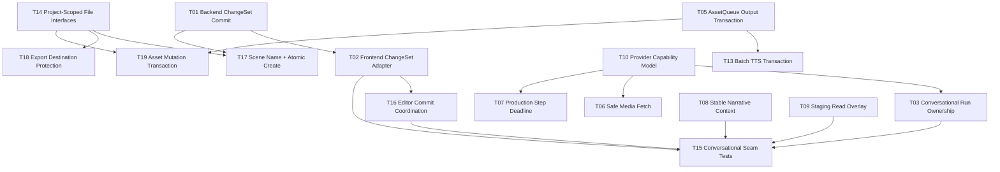

# Ollaic Agent Remediation Plan

## Purpose

This plan validates and deduplicates the Agent architecture review, Red Team review, and two read-only follow-up audits. It defines broken domain invariants, places remediation at testable Seams, maps file conflicts, and splits implementation into independently testable and mergeable tasks. No task is implemented by this planning change.

## Domain Invariants

- **INV-01 Confirmed Write:** Agent-authored Project mutations reach playable files only after confirmation or an explicitly selected Run to Playable policy.
- **INV-02 Preview Isolation:** Pending Preview never enters the live editor buffer or normal save paths before confirmation.
- **INV-03 Atomic Commit:** A multi-resource mutation commits fully or reports a recoverable residual state; rollback failure is never reported as complete rollback.
- **INV-04 Conflict Safety:** Every write validates the exact staged baseline at the write Seam; check-to-write races cannot silently overwrite newer work.
- **INV-05 User Edit Preservation:** Accept, Reject, autosave, navigation, and Agent cleanup cannot silently discard or overwrite newer user buffers or cached drafts.
- **INV-06 Run Ownership:** Only the current conversational Run can execute tools, update shared state, or publish Preview; Stop permanently revokes old ownership.
- **INV-07 Read Your Writes:** One Agent Run observes a coherent Staged Output, including newly created resources.
- **INV-08 Narrative Context:** Function-calling turns receive bounded Project Memory and accepted facts without discretionary tool calls.
- **INV-09 Recoverable Flow Output:** Failed/interrupted Flow and asset mutations leave no untracked playable output outside a rollback record.
- **INV-10 Bounded External I/O:** Provider work is capability-checked, cancellable or deadline-bounded, and media fetch is network- and memory-bounded.
- **INV-11 Secret and Trace Safety:** Credentials/config writes are locally protected and recoverable; traces minimize durable Project content.
- **INV-12 Project-Scoped Access:** File Interfaces enforce Project/domain ownership and approved attachment scope, not arbitrary caller paths.
- **INV-13 Seam Verification:** Critical orchestration behavior is tested across the production persistence and cancellation Seams.

## Finding Disposition

| ID | Normalized Finding | Disposition | Severity | Invariant | Task |
|---|---|---|---|---|---|
| F-01 | Conversational ChangeSet Commit is frontend-orchestrated; rollback failures are hidden | Confirmed | High | INV-03 | T01, T02 |
| F-02 | Conflict detection has TOCTOU and incomplete Asset Metadata/create baselines | Confirmed | High | INV-04 | T01, T02 |
| F-03 | Stop/new-send can reactivate an old conversational Run | Confirmed | High | INV-06 | T03 |
| F-04 | Accept/autosave can overwrite committed or non-current cached user work | Confirmed | High | INV-05 | T16 |
| F-05 | `create_scene + edit/header` can conflict in persistence despite valid staging | Confirmed | High | INV-03, INV-04 | T01, T17 |
| F-06 | Scene background-card metadata writes are outside complete rollback bookkeeping | Confirmed | High | INV-03 | T01 |
| F-07 | AssetQueue playable writes are outside OutputTransaction/project snapshots | Confirmed | High | INV-09 | T05 |
| F-08 | Generated-media fetch validates only initial URL and has no body-size bound | Confirmed | High | INV-10 | T06 |
| F-09 | Raw Scene commands and Scene names permit Project-scope escape | Confirmed | High | INV-12 | T14, T17 |
| F-10 | Export destination can overlap and delete/mutate the source Project | Confirmed | High | INV-12 | T18 |
| F-11 | Asset rename/delete are sequential cross-resource mutations without rollback | Confirmed | High | INV-03, INV-09 | T19 |
| F-12 | Agent Flow Step timeout exists but production constructors disable it | Confirmed | Medium | INV-10 | T07 |
| F-13 | FC context omits mandatory Memory/facts and injects an effectively unbounded current Scene | Confirmed | Medium | INV-08 | T08 |
| F-14 | Read tools do not observe newly staged Scenes and Characters | Confirmed | Medium | INV-07 | T09 |
| F-15 | Function-calling capability is selected by duplicated static provider lists | Confirmed | Medium | INV-10 | T10 |
| F-16 | Provider config is plaintext, non-atomic, and silently defaults after parse failure | Confirmed | Medium | INV-11 | T11 |
| F-17 | Agent traces retain full prompts/tool payloads after narrow secret redaction | Confirmed | Medium | INV-11 | T12 |
| F-18 | Batch TTS asset/metadata writes lack one transaction and shared Project lock | Confirmed | Medium | INV-09 | T13 |
| F-19 | Attachment-turn authorization exists only at the frontend tool layer | Confirmed | Medium | INV-12 | T14 evidence gate/follow-up |
| F-20 | Conversational tests mock persistence and omit critical orchestration races | Confirmed | Medium | INV-13 | T15 |
| F-21 | Preview leaks through Ctrl+S/autosave/close/export/snapshot | Rejected | - | INV-02 | - |
| F-22 | Reject directly restores stale `before` over the live buffer | Rejected | - | INV-05 | - |
| F-23 | Reject draft-cache cleanup has a proven data-loss path | Rejected | - | INV-05 | - |
| F-24 | Multiple created Scenes are never cleanup candidates | Rejected | - | INV-03 | - |
| F-25 | Agent Flow cancellation is ineffective | Rejected | - | INV-06 | - |
| F-26 | Existing non-current Scene has no confirmation-time check | Duplicate | - | INV-04 | F-02 |
| F-27 | Asset Metadata conflict is a separate root cause | Duplicate | - | INV-04 | F-02 |
| F-28 | Provider request continues after Stop is separate from old-Run ownership | Duplicate | - | INV-06 | F-03 |
| F-29 | Redirect SSRF, DNS rebinding, and unbounded body are separate roots | Duplicate | - | INV-10 | F-08 |
| F-30 | Plaintext keys are separate from config durability | Duplicate | - | INV-11 | F-16 |
| F-31 | Compromised WebView can exploit every registered invoke command | Hypothesis | High | INV-12 | T14 evidence gate |
| F-32 | AssetQueue failure always leaves irrecoverable promoted assets | Hypothesis | High | INV-09 | T05 evidence gate |
| F-33 | Character conflict always compares a stale React snapshot | Hypothesis | Medium | INV-04 | T01 evidence gate |
| F-34 | Batch TTS necessarily violates Agent Preview policy | Deferred | - | INV-01 | Product policy decision |
| F-35 | OS keychain migration is mandatory in the first wave | Deferred | - | INV-11 | T11 product decision |

## Rejection and Deferral Notes

- F-21 is rejected: Preview derives from `pendingChangeSet`; normal save paths use live `nodes/scriptSource`.
- F-22 is rejected: Reject changes status and does not write staged `before` content into the live buffer.
- F-23 is rejected after a second path analysis: restoring a cached Scene does not delete its cache entry, and switching away from a dirty Scene re-stashes it. No reproducible loss path was established.
- F-24 is rejected: created paths are tracked and deletion is attempted; F-01 retains swallowed rollback errors.
- F-25 is rejected for Agent Flow: scheduler cancellation drops the in-flight future and the real cancellation test passes.
- F-31 requires an effective Tauri capability/threat-model test. Missing backend path scope remains confirmed as F-09/F-19.
- F-32's missing transaction coverage is confirmed; the exact residual artifact set requires fault injection.
- Direct user-triggered TTS may be an explicit write command, so Preview policy is deferred while its transaction defect remains F-18.

## Dependency Graph

## Hotspot Conflict Graph

| Hotspot | Tasks | Merge rule |
|---|---|---|
| `design/src/app/hooks/useAiAgent.ts` | T02, T03, T08, T09, T10, T12, T16, T15 | Strict serial rebase in recommended order. |
| `design/src/app/lib/change-set.ts` | T02, T09, T16, T15 | T02 request shape first; overlay and editor coordination after. |
| `design/src/app/components/StoryEditor.tsx` | T02, T16, T15 | Do not parallel-merge T02/T16. |
| `src-tauri/src/ai/commands.rs` | T03, T06, T07, T10, T12, T13, T14 | Keep new Interfaces in separate modules; merge callers serially. |
| `src-tauri/src/webgal/commands.rs` | T01, T14 | ProjectPaths first if implementation overlaps command signatures; otherwise rebase T01. |
| `src-tauri/src/webgal/project.rs` | T17, T18 | T17 then T18. |
| `src-tauri/src/pipeline/scheduler.rs` | T05, T07 | T05 then T07. |
| `src-tauri/src/assets/commands.rs` | T01, T05, T13, T14, T19 | Transaction/path foundations before caller migrations. |
| `src-tauri/src/ai/config.rs` | T10, T11 | T10 then T11. |
| Invoke registration/capabilities | T01, T03, T14 | One command family per merge; verify names after each. |

## Task Inventory

| Task | Title | Status | Severity | Dependencies |
|---|---|---|---|---|
| [T01](T01-backend-change-set-commit.md) | Backend ChangeSet Commit Interface | Ready | High | None |
| [T02](T02-frontend-change-set-adapter.md) | Frontend ChangeSet Adapter Migration | Blocked | High | T01 |
| [T03](T03-conversational-run-ownership.md) | Conversational Run Ownership and Cancellation | Blocked | High | T10 |
| [T04](T04-reject-draft-preservation.md) | Reject Draft Preservation | Cancelled | - | Rejected F-23 |
| [T05](T05-asset-queue-output-transaction.md) | AssetQueue Output Transaction | Ready | High | None |
| [T06](T06-safe-media-fetch.md) | Safe Bounded Media Fetch | Blocked | High | T10 |
| [T07](T07-production-step-deadline.md) | Agent Flow Step Deadline | Blocked | Medium | T10 |
| [T08](T08-stable-narrative-context.md) | Stable Narrative Context | Ready | Medium | None |
| [T09](T09-staging-read-overlay.md) | Staged Output Read Overlay | Ready | Medium | None |
| [T10](T10-provider-capability-model.md) | Provider Capability Model | Ready | Medium | None |
| [T11](T11-recoverable-provider-config.md) | Recoverable Provider Configuration | Ready | Medium | None |
| [T12](T12-trace-data-minimization.md) | Agent Trace Data Minimization | Ready | Medium | None |
| [T13](T13-batch-tts-transaction.md) | Batch TTS Transaction and Project Lock | Blocked | Medium | T05 |
| [T14](T14-project-scoped-file-interfaces.md) | Project-Scoped File Interfaces | Ready | High | None |
| [T15](T15-conversational-seam-tests.md) | Conversational Orchestration and Persistence Seam Tests | Blocked | Medium | T02, T03, T16, T08, T09 |
| [T16](T16-editor-commit-coordination.md) | Editor Commit Coordination | Blocked | High | T02 |
| [T17](T17-scene-name-atomic-create.md) | Scene Name Validation and Atomic Create | Blocked | High | T14, T01 |
| [T18](T18-export-destination-protection.md) | Export Destination Protection | Blocked | High | T14 |
| [T19](T19-asset-mutation-transaction.md) | Asset Rename and Delete Transaction | Blocked | High | T05, T14 |

T04 is retained as a cancelled audit artifact so the rejected Finding does not silently disappear. It must not be implemented unless new reproduction evidence reopens it.

## Recommended Serial Merge Order

1. T01 Backend ChangeSet Commit Interface
2. T14 Project-Scoped File Interfaces
3. T02 Frontend ChangeSet Adapter Migration
4. T16 Editor Commit Coordination
5. T17 Scene Name Validation and Atomic Create
6. T18 Export Destination Protection
7. T10 Provider Capability Model
8. T03 Conversational Run Ownership and Cancellation
9. T06 Safe Bounded Media Fetch
10. T07 Agent Flow Step Deadline
11. T05 AssetQueue Output Transaction
12. T19 Asset Rename and Delete Transaction
13. T13 Batch TTS Transaction and Project Lock
14. T09 Staged Output Read Overlay
15. T08 Stable Narrative Context
16. T11 Recoverable Provider Configuration
17. T12 Agent Trace Data Minimization
18. T15 Conversational Orchestration and Persistence Seam Tests

Cancelled T04 is excluded from merge order. Every implementation task carries focused tests; T15 adds cross-Seam regressions only after Interfaces stabilize.
